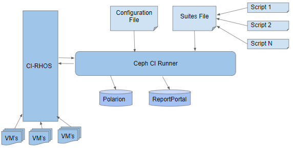

Introduction
************
CEPH-CI is a framework coupled with CentralCI and Red Hat Builds for testing Ceph downstream builds with Jenkins.
It makes use of PSI (Red Hat OpenStack) lab to create/destroy Ceph resources dynamically.

Currently the RHCS-QE team uses this environment to test and qualify the downstream builds everyday using automated jenkins workflow.

High Level Architecture
-----------------------

* Infrastructure
    - CI-RHOS: Red Hat OpenStack
* Test configuration
    - configuration: ceph cluster configuration
    - suites: test suites
    - scripts: test scripts
* Reporting and Lifecycle tools
    - Polarion-ALM: Application Lifecycle Management tool
    - ReportPortal: portal to store up results

Test configuration
-------------------

Cluster Configuration
=====================
Cluster configuration files are kept in a directory under `conf` for each ceph version.

+------------------------+-------------------------+-----------------+
| Ceph upstream codename | RH Ceph Storage Release | Location        |
+========================+=========================+=================+
|  Jewel (EOL)           | RH Ceph Storage 2       | `conf/jewel`    |
+------------------------+-------------------------+-----------------+
|  Luminous              | RH Ceph Storage 3       | `conf/luminous` |
+------------------------+-------------------------+-----------------+
|  Nautilus              | RH Ceph Storage 4       | `conf/nautilus` |
+------------------------+-------------------------+-----------------+
|  Pacific               | RH Ceph Storage 5       | `conf/pacific`  |
+------------------------+-------------------------+-----------------+

The image-name inside globals: define what image is used to clone ceph-nodes(
mon, osd, mds etc), The role maps to ceph role that the node will take
and osd generally attach 3 additional volumes with disk-size as specified in
config.

Inventory Files
===============
Inventory files represents OS platforms and are kept under **conf/inventory**.
These files are used for deploying Ceph using Specific OS platform and version. for example.,
``cephci/conf/inventory/rhel-8.4-server-x86_64.yaml``

Test Suites
===========
All test suite configurations are found inside the **suites** directory.
There are various suites that are mapped to versions of Ceph under **tests**.
.. code-block::

    suites/luminous/ansible/sanity_ceph_ansible     will be valid for 3.0 builds
    suites/nautilus/ansible/sanity_ceph_ansible     will be valid for 4.0 builds
    suites/pacific/cephadm                          will be valid for 5.0 builds

The tests inside the suites are described in yaml data format

.. code-block:: yaml

        tests:
            - test:
                  name: ceph deploy
                  module: test_ceph_deploy.py
                  config:
                      base_url: 'http://download-node-02.eng.bos.redhat.com/rcm-guest/ceph-drops/auto/ceph-1.3-rhel-7-compose/RHCEPH-1.3-RHEL-7-20161010.t.0/'
                      installer_url:
                  desc: test cluster setup using ceph-deploy
                  destroy-cluster: False
                  abort-on-fail: True
            - test:
                  name: rados workunit
                  module: test_workunit.py
                  config:
                      test_name: rados/test_python.sh
                      branch: hammer
                  desc: Test rados python api

The above snippet describes two tests and the module is the name of the python
script that is executed to verify the test, every module can take a config
dict that is passed to it from the run wrapper, The run wrapper executes
the tests serially found in the suites. The test scripts are location in
the `tests` folder.
